# MenoCompass flow audit — 2026-08-31

## Audit scope

Combined UX and screenshot-based accessibility review of the root PWA at a 390 × 844 mobile viewport. The reviewed journey was: first run → profile setup → stage assessment → compact daily check-in → Trends → Medications → clinician Report → Settings → Evidence guide → Detailed daily log.

The user goal is to understand what is happening, record the day quickly, learn from patterns, and arrive at a clinician appointment with useful evidence. The accessibility target is a readable, keyboard- and touch-usable mobile flow with clear state and next actions.

## Overall verdict

The app has unusually thoughtful clinical content and good anatomy-aware branching, but the product is organized as a feature inventory rather than a continuous care loop. The compact check-in cannot create several of the outputs promoted in Trends and Report; the full log and Evidence guide are hidden in Settings; treatment changes never join the symptom timeline; and autosave offers no clear “today is done” moment.

The redesign should organize everything around one loop:

**Check in → understand what changed → choose one useful action → prepare for care.**

## Flow evidence

1. **Welcome — healthy but incomplete.** The value proposition and privacy promise are clear, but “Step 1 of 2” understates the additional 5–7-question stage assessment that follows.

   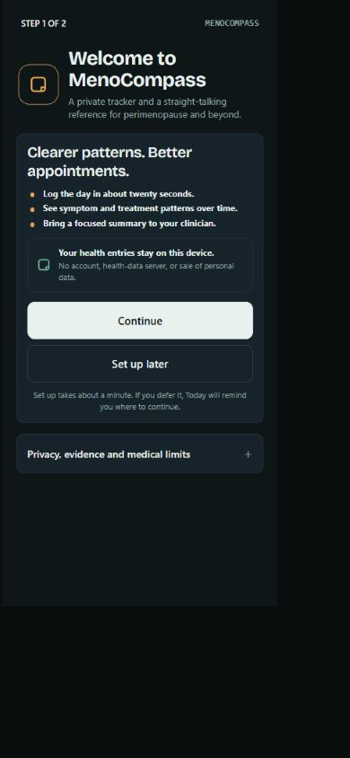

2. **Basic setup — needs simplification.** Optional fields are appropriately labeled, yet “Continue to your stage” starts a separate journey after the UI says the user is on the final setup step.

   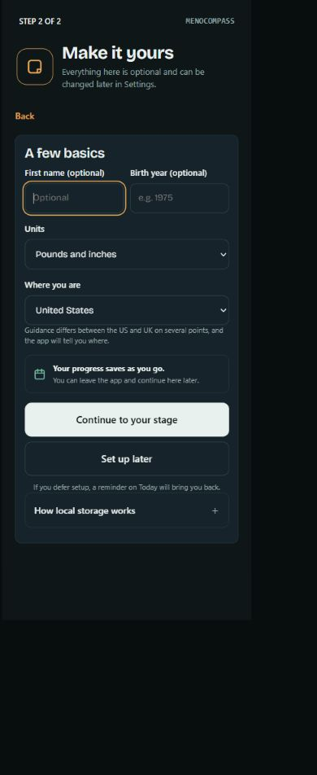

3. **Stage assessment — clinically strong, product handoff weak.** Adaptive questions and focus treatment are good. The assessment appears as a modal over an already-live Today screen, so setup feels interrupted rather than completed.

   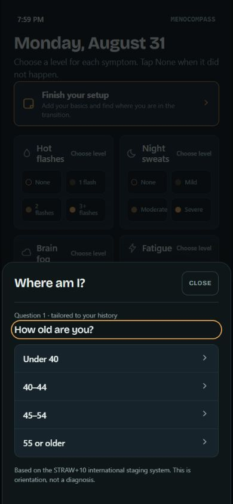

4. **Stage result — clear result, weak next step.** The result is understandable, but “Done” returns to a symptom grid without turning the result into a personalized starting plan.

   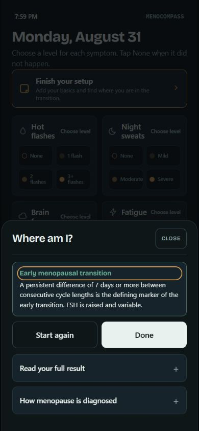

5. **Compact Today — fast but structurally incomplete.** Six prominent symptom tiles are easy to tap, but this screen omits sleep hours, sleep quality, low mood, movement, alcohol, weight, waist, and five symptoms needed by downstream charts.

   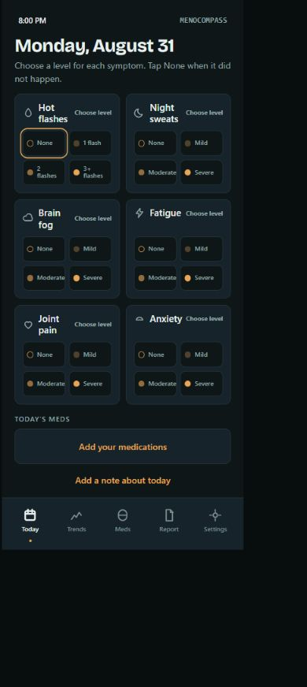

6. **Logged Today — missing closure.** Selected states are visible, but there is no confirmation, completion state, or summary of what changed. Autosave answers “was it stored?” only in hidden implementation behavior.

   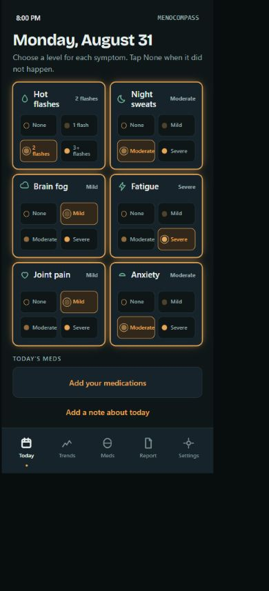

7. **Early Trends — informative but discouraging.** The page immediately presents five metrics and several empty charts after one day. The useful message—keep logging for two weeks—is visually secondary to unavailable outputs.

   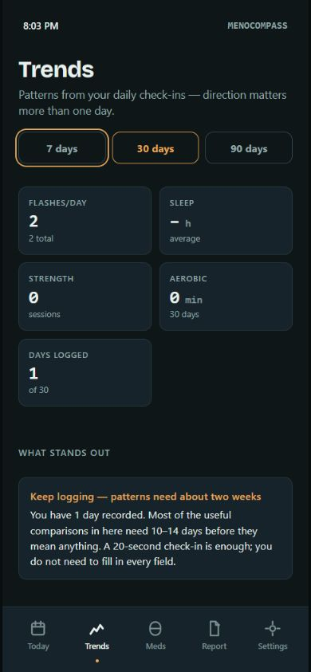

   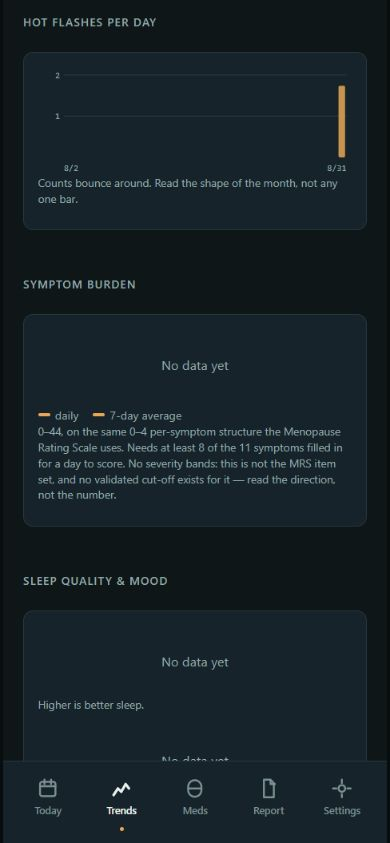

8. **Medication setup — clean empty state, disconnected model.** Adding a medication is obvious, but medication schedules, adherence, symptoms, and dose changes never become one treatment story.

   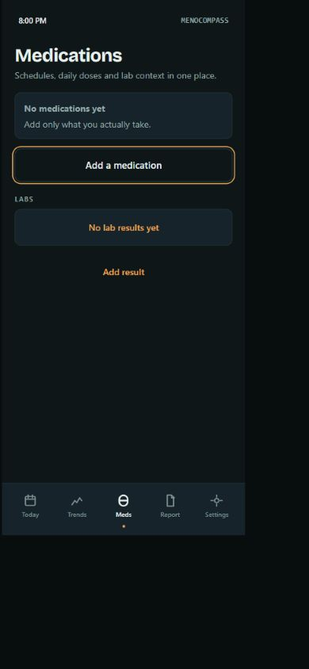

9. **Report preview — premature and misleading.** The 30d/90d/180d controls look selectable, but the current implementation hard-codes 90 days. A report is promoted before enough evidence exists.

   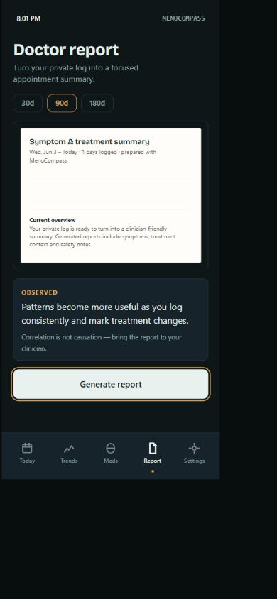

10. **Settings — unhealthy information architecture.** Profile, stage, goals, tools, preferences, privacy, the Evidence guide, and the full daily log all compete on one destination. Two core product surfaces are presented as settings.

    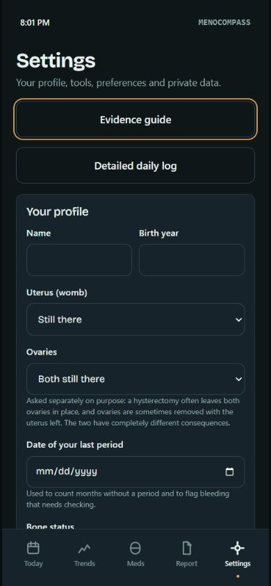

11. **Evidence guide — strong library, hidden from the care loop.** Topics are clear and trustworthy, but education is a separate catalog instead of appearing at the moment a pattern or decision makes it useful.

    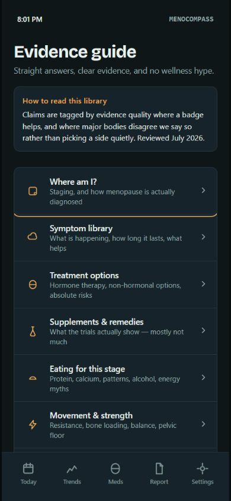

    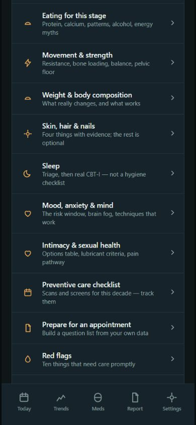

12. **Detailed daily log — comprehensive but exhausting.** This buried screen contains the data that Trends and Report actually need. Its density, 14-day picker, 11 symptom scales, sleep, body, bleeding, movement, food, notes, red flags, and tools create a very long commitment with no progressive disclosure.

    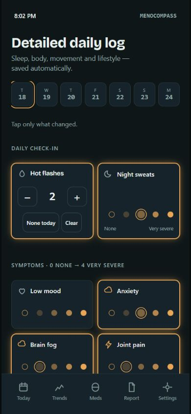

    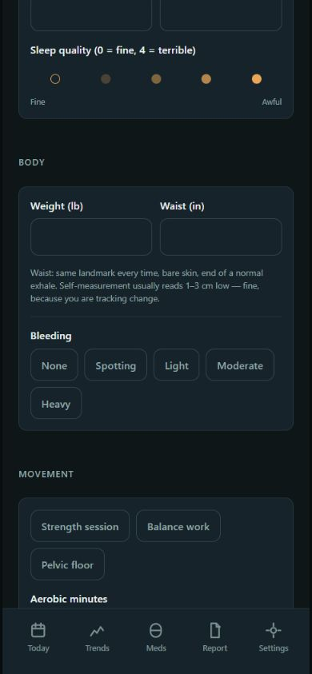

    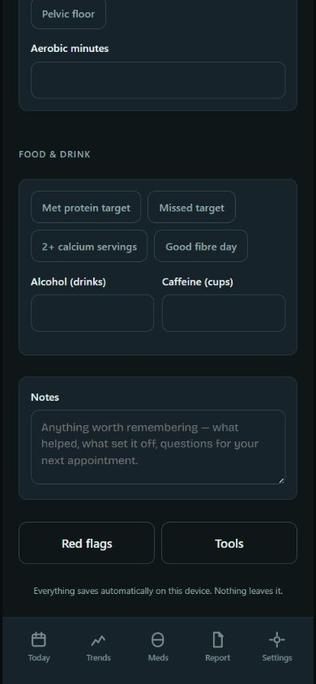

13. **Generated clinician report — valuable endpoint.** The summary is legible and appropriately caveated. It should be the earned result of a guided “prepare for my appointment” flow, not a permanent peer tab.

    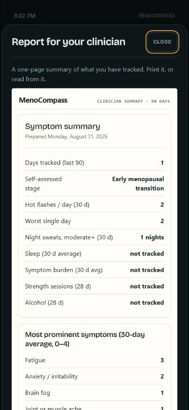

## Highest-impact changes

1. Replace five feature-equal tabs with a journey-led shell: **Today, Journey, Guide**, plus Profile in the header. Put Report inside an explicit appointment-prep flow and integrate medication/treatment events into Journey.
2. Make Today adaptive. Start with a single “How are you today?” action, preload only yesterday’s answers as suggestions, and ask the smallest set of follow-ups needed for the user’s active symptoms and current goals.
3. Add an explicit completion moment: “Today is logged,” a short change summary, and one contextual next action. Do not count copied-but-unconfirmed data as a logged day.
4. Turn Trends into Journey: a chronological symptom-and-treatment timeline, a weekly insight, treatment-change markers, and progressive data sufficiency. Hide unavailable charts until enough data exists.
5. Make education contextual. Deep-link one relevant evidence module from an insight, red flag, medication, or stage result while preserving a searchable Guide for deliberate browsing.
6. Make “Prepare for care” a guided mode: choose an appointment goal, confirm date range and treatment changes, review missing context, generate the report, then build a question list.
7. Keep profile, anatomy, region, units, appearance, privacy, and data controls in Settings. Move everything else out.

## Accessibility risks and limits

- Visible focus treatment, labeled controls, large touch targets, semantic dialog structure, and inert background behavior are strengths confirmed during the run.
- Muted gray-green helper text and 10–11 px labels may be difficult for low-vision users; exact contrast and computed font-size testing is still required.
- Severity is communicated with both position and text, which is good, but the many small adjacent choices increase motor and cognitive load.
- Autosaved state changes are visually indicated but should also have an explicit completion/status announcement for screen-reader users.
- Screenshot review cannot establish complete WCAG conformance. Screen-reader names/order, keyboard traversal of every sheet, zoom/reflow, reduced motion, and native WebView safe-area behavior need separate testing.

## Evidence limits

The root PWA is the source experience embedded in the native app. This review did not cover the native RevenueCat paywall, iOS safe areas, attribution prompts, file bridge behavior, or a physical-device screen reader. Full-page stitched captures that duplicated fixed content were rejected; the accepted long-page evidence is split into normal viewport captures.
